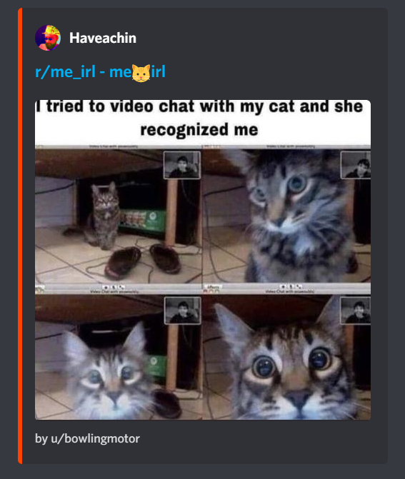
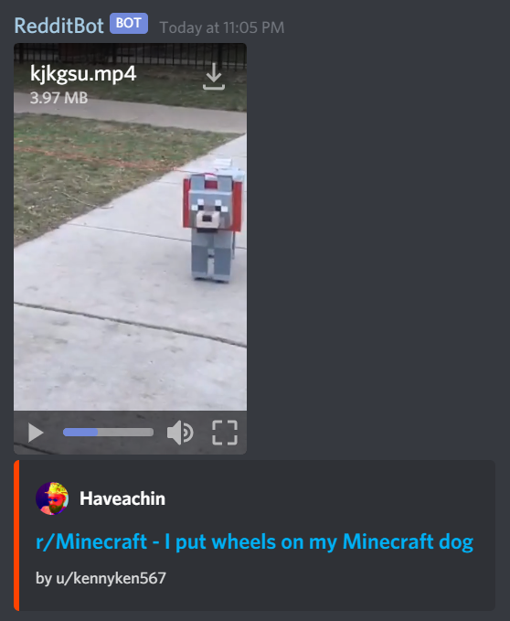

# reddit-bot
A discord bot that replaces image/gif, text, and video posts with a rich preview  
# [Invite the bot](https://discord.com/oauth2/authorize?client_id=699350209888518244&scope=bot&permissions=59456)

### Image Preview

### Video Preview

### Text Preview (1000 Character limit)

yt-dlp -o someid.mp4 --postprocessor-args "-c:v libx264 -c:a aac -crf 24 -preset faster -tune film -vf scale=min(480, iw):-2" https://v.redd.it/clu59q43znib1/DASHPlaylist.mpd?a=1694880934%2CZThjYzZlYmM5ZTg1YWE1OWI2YTAxNzZkY2UwYzU5MmU3ZGE3MGEzMmYyZmRlNTE1MTU4NjI2MWQzNjRhMDgxNw%3D%3D&amp;v=1&amp;f=sd